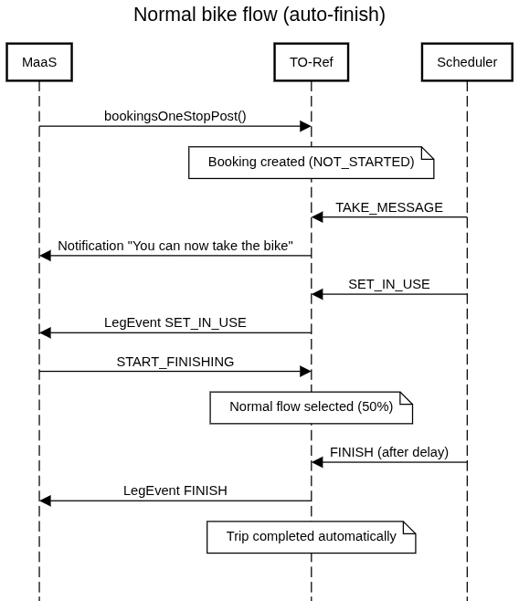
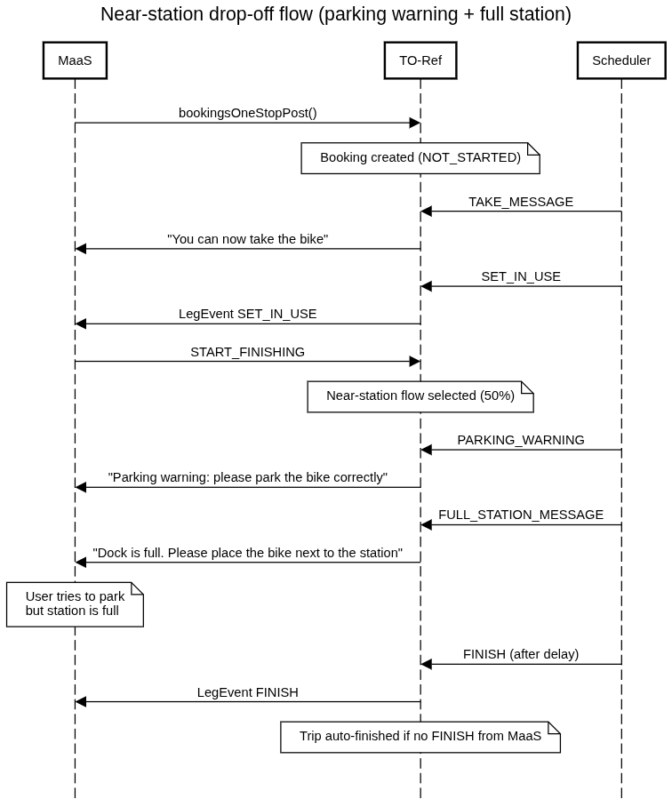
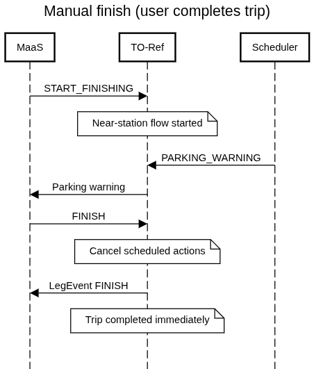
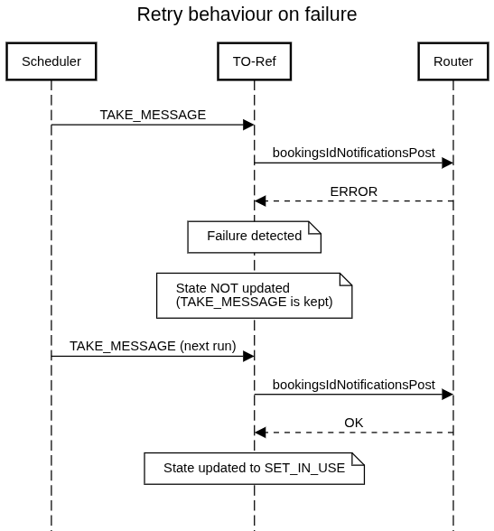

# shared-mobility-to-ref

Reference implementation of a backend that implements a [TOMP API](https://github.com/TOMP-WG/TOMP-API) from the TO (Transport Operator) side.
You can find the full Swagger Petstore documentation from the TOMP-team 
[here](https://app.swaggerhub.com/apis-docs/TOMP-API-WG/transport-operator_maas_provider_api/1.5.0#/).

## Guide for transport operators on how to implement TOMP standard

This guide covers all the endpoints needed for supporting the TOMP standard and how to implement them. 
This is a shorten list of all the endpoints supported by the [TOMP standard](https://github.com/TOMP-WG/TOMP-API).

You can find the Swagger Petstore documentation for this app [here](https://petstore.swagger.io/?url=https://api.dev.entur.io/api-docs/shared-mobility-to-ref)

| Endpoints                                                                       | Purpose                                               |
|---------------------------------------------------------------------------------|-------------------------------------------------------|
| [GET /operator/meta](#tomp-api-implementation-guide-get-operatormeta)           | Describes the running implementations                 |
| [POST /planning/offers](#tomp-api-implementation-guide-post-planningoffers)     | Convert QR-code to assetId/vehicleId/bike_id          |
| [POST /bookings/one-stop](#tomp-api-implementation-guide-post-bookingsone-stop) | Creates a one-stop booking                            |
| [POST /legs/{id}/events](#tomp-api-implementation-guide-post-legsidevents)      | Alters the state of a leg                             |
| [GET /bookings/{id}](#tomp-api-implementation-guide-get-bookingsid)             | Returns a booking given id                            |
| [GET /legs/{id}](#tomp-api-implementation-guide-get-legsid)                     | Retrieves the latest summary of a leg                 |
| [GET /bookings](#tomp-api-implementation-guide-get-bookings)                    | Retrieves a list of bookings based on various filters |

### Request Headers
The request headers are equal for all endpoints:

- **Accept-Language**:
  - **Description**: A list of the languages/localizations the user would like to see the results in. For user privacy and ease of use on the TO side, this list should be kept as short as possible, ideally just one language tag from the list in `operator/information`.
  - **Required**: Yes
- **Api**:
  - **Description**: API description, can be TOMP or maybe other (specific/derived) API definitions.
  - **Required**: Yes
- **Api-Version**:
  - **Description**: Version of the API.
  - **Required**: Yes
- **maas-id**:
  - **Description**: The ID of the sending MaaS operator.
  - **Required**: Yes
- **addressed-to**:
  - **Description**: The ID of the MaaS operator that has to receive this message.
  - **Required**: No

### TOMP API Implementation Guide: GET "/operator/meta"

This guide outlines how transport operator's can implement the `GET "/operator/meta"` endpoint, 
which is used to retrieve information about how the transport operator's API works and which endpoints that are supported. 
The controller code can be found [here](src/main/kotlin/no/entur/shared/mobility/to/ref/controller/OperatorController.kt).

Response model can be found [here](src/main/kotlin/no/entur/shared/mobility/to/ref/data/MetaProvider.kt). 
Note that the response is a list of EndpointImplementation. 
Required variables in the response:

- **version**: The version of the transport operator's implementation of the TOMP API.
- **baseUrl**: The base URL for the transport operator's implementation of the TOMP API.
- **endpoints**: A list of supported endpoints in the transport operator's implementation of the TOMP API.
  - **method**: [ POST, PUT, GET, DELETE, PATCH ]
  - **status**: [ NOT_IMPLEMENTED, DIALECT, IMPLEMENTED ]
  - **paths**: Should be one of the types listed [here](src/main/kotlin/no/entur/shared/mobility/to/ref/data/EndpointType.kt).
- The rest of the "required" variables can be set as an empty list since it's not supported in Entur's implementation yet.

### TOMP API Implementation Guide: POST "/planning/offers" 
This guide outlines how transport operator's can implement the `POST "/planning/offers"` endpoint,
which right now is only used to go from the vehicleCode (last part of the QR-code) to an offer that includes the assetId/vehicleId/bike_id.

When the shared-mobility api receives a QR-code, we need to find and send the generic UUID used in the GBFS data to the clients, 
so that they can show the user information about a modality before starting the trip.

Example for how to get from the vehicleCode "157103" to the assetId/vehicleId/bike_id "YRY:Vehicle:ea110245-131d-3109-ba91-b5bd57701934":

#### Example request
```json
{
  "from": {
    "coordinates": {
      "lng": 0.00,
      "lat": 0.00
    },
    "extraInfo": {
      "vehicleCode": "157103"
    }
  }
}
```

#### Example response
```json
{
  "validUntil": "2024-08-07T05:53:04.758",
  "options": [
    {
      "legs": [
        {
          "asset": {
            "id": "YRY:Vehicle:ea110245-131d-3109-ba91-b5bd57701934",
            "stateOfCharge": 47,
            "overriddenProperties": {
              "meta": {
                "vehicleCode": "157103"
              }  
            }
          }
        }
      ]
    }
  ]
}
```

### TOMP API Implementation Guide: POST "/bookings/one-stop"
This guide outlines how transport operator's can implement the `POST "/bookings/one-stop"` endpoint,
which is used to create a one-stop booking. This is for travels without a specified final destination.
The controller code can be found [here](src/main/kotlin/no/entur/shared/mobility/to/ref/controller/BookingsController.kt).

The first id in the request.useAssets list will always be the mobility the user wants to book for a trip. 
This id is from the [public GBFS data](https://developer.entur.org/pages-mobility-docs-mobility-v2).

Response model can be found [here](src/main/kotlin/no/entur/shared/mobility/to/ref/dto/Booking.kt).
The model has many optional variables because it is designed to support booking of many different modalities, 
but because Entur currently only supports booking of micromobility, only these variables are required:
- **id**: Unique identifier. Should be the same as "leg.id" for one-stop booking.
- **from**: Where the customer is traveling from. Model: [Place](src/main/kotlin/no/entur/shared/mobility/to/ref/dto/Place.kt)
  - **name**: Name of the place.
  - **coordinates**: Coordinates of the place. Model: [Coordinates](src/main/kotlin/no/entur/shared/mobility/to/ref/dto/Coordinates.kt)
- **customer**: Information about the traveling customer. Model: [Customer](src/main/kotlin/no/entur/shared/mobility/to/ref/dto/Customer.kt)
  - **id**: The identifier Entur uses to identify the customer.
- **state**: The state of the booking. Model: [BookingState](src/main/kotlin/no/entur/shared/mobility/to/ref/dto/BookingState.kt)
- **pricing** The pricing of the booking. Model: [Fare](src/main/kotlin/no/entur/shared/mobility/to/ref/dto/Fare.kt)
  - **estimated**: Is this fare an estimation?
  - **parts**: Should contain one part per leg with the total per leg. All the priced parts. Model: List of [FarePart]
    (src/main/kotlin/no/entur/shared/mobility/to/ref/dto/FarePart.kt).
    Pricing should be kept up to date during trip execution.
- **legs**: A list of all legs in the booking. Since this is a one-stop booking this list should only include one leg. 
    Model: List of [Leg](src/main/kotlin/no/entur/shared/mobility/to/ref/dto/Leg.kt)
  - **id**: Unique identifier. Should be the same as "booking.id" for one-stop booking.
  - **from**: Where the customer is traveling from. For one-stop booking this variable should be identical as the "booking.from" variable.
    Model: [Place](src/main/kotlin/no/entur/shared/mobility/to/ref/dto/Place.kt)
  - **arrivalTime**: The intended arrival time at the to place. Or, in case of a parking, the end of the usage.
  - **actualArrivalTime**: the 'arrivalTime' can be used as 'plannedArrivalTime' whenever the leg has ended. Use this field to ease 
    searching for discrepancies between planned and actual arrival times.
  - **departureTime**: The departure time of this leg. Or, in case of a parking, the start of the usage.
  - **actualDepartureTime**: the 'departureTime' can be used as 'plannedDepartureTime' whenever the leg has started. Use this field to ease
    searching for discrepancies between planned and actual departure times.
  - **assetType**: Type of asset. Model: [AssetType](src/main/kotlin/no/entur/shared/mobility/to/ref/dto/AssetType.kt)
    - **id** Unique identifier. 
  - **asset**: The booked asset for the trip. Model: [Asset](src/main/kotlin/no/entur/shared/mobility/to/ref/dto/Asset.kt)
    - **id** Unique identifier. Should be the same id as given from the useAssets request variable.
    - **stateOfCharge** The current charge of the vehicle. Integer 0-100. This should be kept up to date during trip execution
    - **overriddenProperties.meta.vehicleCode** If you have your own vehicleCode for the modality, this field should always be set
  - **pricing**: Price plan for the leg witt a fixed part for start cost and one ore more flexible parts where applicable Model: [Fare]
    (src/main/kotlin/no/entur/shared/mobility/to/ref/dto/Fare.kt)
  - **conditions**: The conditions that apply to this leg. 
    Model: List of [AssetTypeConditionsInner](src/main/kotlin/no/entur/shared/mobility/to/ref/dto/AssetTypeConditionsInner.kt)
    - **ConditionDeposit::class**: Gives us information about the preferred deposit amount. 
      Model: [ConditionDeposit](src/main/kotlin/no/entur/shared/mobility/to/ref/dto/ConditionDeposit.kt)
    - **ConditionRequireOffboardingSteps::class**: Used if the transport operator wants a parking picture of the bike/scooter.
      Model: [ConditionRequireOffboardingSteps](src/main/kotlin/no/entur/shared/mobility/to/ref/dto/ConditionRequireOffboardingSteps.kt)
  - **state**: The state of the leg. When creating a one-stop booking this state should be set to ASSIGN_ASSET. Model: [LegState](src/main/kotlin/no/entur/shared/mobility/to/ref/dto/LegState.kt)
departureTime, arrivalTime, actualDepartureTime and actualArrivalTime on the Booking is optional 
since Entur only use the variables from the [Leg](src/main/kotlin/no/entur/shared/mobility/to/ref/dto/Leg.kt).

#### Example request
```json
{
  "customer": {
    "id": "3519743"
  },
  "extraInfo": null,
  "useAssets": [
    "YVO:Vehicle:ca72ffde-d4b9-4f6a-996d-265d78c06817"
  ],
  "from": {
    "coordinates": {
      "lng": 0.00,
      "lat": 0.00
    }
  }
}
```

#### Example response
```json
{
  "from": {
    "name": "Oslo S",
    "coordinates": {
      "lat": 0.00,
      "lng": 0.00
    }
  },
  "pricing": {
    "parts": [
      {
        "vatCountryCode": "NO",
        "amount": 50,
        "currencyCode": "NOK",
        "vatRate": 25,
        "amountExVat": 40,
        "type": "FIXED"
      }
    ],
    "estimated": false
  },
  "customer": {
    "id": "123456"
  },
  "assetType": {
    "id": "BLA:AssetType:MEH"
  },
  "arrivalTime": "2024-08-19T18:44:50.40197651+02:00",
  "departureTime": "2024-08-19T18:32:50.401973859+02:00",
  "actualArrivalTime": "2024-08-19T18:44:50.402119825+02:00",
  "actualDepartureTime": "2024-08-19T18:32:50.402118727+02:00",
  "state": "CONFIRMED",
  "id": "0b52bd86-9a97-4459-bbaa-a109ea0ca637",
  "legs": [
    {
      "asset": {
        "stateOfCharge": 100,
        "id": "YVO:Vehicle:ca72ffde-d4b9-4f6a-996d-265d78c06817",
        "overriddenProperties": {
          "meta": {
            "vehicleCode": "1234ABCD"
          }
        }
      },
      "departureTime": "2024-08-19T18:32:50.401465241+02:00",
      "actualDepartureTime": "2024-08-19T18:32:50.401602653+02:00",
      "id": "string",
      "from": {
        "coordinates": {
          "lng": 0,
          "lat": 0
        }
      },
      "state": "NOT_STARTED"
    }
  ]
}
```

### TOMP API Implementation Guide: POST "/legs/{id}/events"

This guide outlines how transport operator's can implement the `POST "/legs/{id}/events"` endpoint, which is used to alter the state of a leg. 
The controller code can be found [here](src/main/kotlin/no/entur/shared/mobility/to/ref/controller/LegsController.kt).

Response model can be found [here](src/main/kotlin/no/entur/shared/mobility/to/ref/dto/Leg.kt).

Required fields are described in the [POST /bookings/one-stop](#tomp-api-implementation-guide-post-bookingsone-stop) guide above.


| Event           | Action                                                                                                                                                                                                                                                                                                                      |
|-----------------|-----------------------------------------------------------------------------------------------------------------------------------------------------------------------------------------------------------------------------------------------------------------------------------------------------------------------------|
| SET_IN_USE      | Set the event on the leg to IN_USE, set the state on the booking to STARTED, set the actualDepartureTime (if this is the first SET_IN_USE event) and let the user start using your mobility.                                                                                                                                |
| PAUSE           | Set the event on the leg to PAUSED and pause the use of the mobility.                                                                                                                                                                                                                                                       |
| START_FINISHING | Set the event on the leg to FINISHING, make sure that the pricing field is updated with the final amount and make the mobility available for other users and set the actualArrivalTime. This event is usually used when the transport operator wants the user to do a action like taking av picture of the parked mobility. |
| FINISH          | Check the picture of the parked mobility if needed, set the event on the leg to FINISHED, set the state on the booking to FINISHED.                                                                                                                                                                                         |
| CANCEL          | Set the event on the leg to CANCELLED, set the state of the booking to CANCELLED and make the mobility available for other users.                                                                                                                                                                                           |

#### Example request
```json
{
  "asset": {
    "id": "a3d63620-e1d7-4c46-a4a4-b8b0fafe5b00"
  },
  "event": "SET_IN_USE",
  "time": "2024-08-19T15:59:20.490991864+02:00"
}
```

#### Example response
```json
{
  "asset": {
    "stateOfCharge": 100,
    "id": "YVO:Vehicle:ca72ffde-d4b9-4f6a-996d-265d78c06817",
    "overriddenProperties": {
      "meta": {
        "vehicleCode": "1234ABCD"
      }
    }
  },
  "departureTime": "2024-08-19T18:32:50.401465241+02:00",
  "actualDepartureTime": "2024-08-19T18:32:50.401602653+02:00",
  "id": "string",
  "from": {
    "coordinates": {
      "lng": 0,
      "lat": 0
    }
  },
  "state": "NOT_STARTED"
}
```

### TOMP API Implementation Guide: GET "/bookings/{id}"
This guide outlines how transport operators can implement the `GET "/bookings/{id}"` endpoint, which is used to retrieve booking details by booking ID. The controller code can be found [here](src/main/kotlin/no/entur/shared/mobility/to/ref/controller/BookingsController.kt).

#### Path Variables:
```
- **id**:
  - **Description**: Booking identifier.
  - **Required**: Yes
```

#### Example Request:
```http
GET /bookings/12345 HTTP/1.1
Accept-Language: en
Api: TOMP
Api-Version: 1.0
maas-id: example-maas-id
addressed-to: receiver-maas-id
```

#### Response Model:
The response will be a `Booking` object. The model can be found [here](src/main/kotlin/no/entur/shared/mobility/to/ref/dto/Booking.kt). The model has many optional variables because it is designed to support booking of many different modalities, but because Entur currently only supports booking of micro mobility, only these variables are required:

Required fields are the same as described in the POST /bookings/one-stop guide above.


### TOMP API Implementation Guide: GET "/legs/{id}"

This guide outlines how transport operators can implement the `GET "/legs/{id}"` endpoint, which retrieves the latest summary of a leg. A leg is a segment of a journey traveled using one asset (vehicle). Every leg belongs to one booking, and every booking has at least one leg. The booking describes the agreement between the user/MP and the TO, while the leg describes the journey as it occurred. Refer to section (4.3) in the flow chart - trip execution for more details.

#### Endpoint Summary

- **Operation ID**: legsIdGet
- **Summary**: Retrieves the latest summary of the leg.
- **Description**: Retrieves the latest summary of the leg, being the execution of a portion of a journey traveled using one asset (vehicle). Every leg belongs to one booking, and every booking has at least one leg. Where the booking describes the agreement between the user/MP and TO, the leg describes the journey as it occurred. See (4.3) in the flow chart - trip execution.

#### Request

- **HTTP Method**: GET
- **Path**: `/legs/{id}`
- **Produces**: `application/json`

#### Path Variables

- **id**: (Required) Leg identifier.

#### Responses

- **200**: Operation successful.
  - **Content**: `application/json`
  - **Schema**: [Leg](src/main/kotlin/no/entur/shared/mobility/to/ref/dto/Leg.kt)
- **401**: Unauthorized - The client must authenticate itself to get the requested response.
  - **Content**: `application/json`
  - **Schema**: [Error](src/main/kotlin/no/entur/shared/mobility/to/ref/dto/Error.kt)
- **403**: Forbidden - The client does not have access rights to the content, i.e., they are unauthorized, so the server is rejecting to give a proper response. Unlike 401, the client's identity is known to the server.
  - **Content**: `application/json`
  - **Schema**: [Error](src/main/kotlin/no/entur/shared/mobility/to/ref/dto/Error.kt)
- **404**: Not Found - The requested resources do not exist, or the requester is not authorized to see it or know it exists.

#### Example Request
```http
GET /legs/{id} HTTP/1.1
Host: api.shared-mobility.com
Accept-Language: en
Api: TOMP
Api-Version: 1.0
maas-id: maasOperator123
addressed-to: toOperator456
```

#### Example Response
```json
{
  "id": "leg123",
  "bookingId": "booking123",
  "from": {
    "name": "Start Location",
    "coordinates": {
      "latitude": 59.911491,
      "longitude": 10.757933
    }
  },
  "to": {
    "name": "End Location",
    "coordinates": {
      "latitude": 59.912491,
      "longitude": 10.758933
    }
  },
  "startTime": "2024-06-25T10:00:00Z",
  "endTime": "2024-06-25T10:15:00Z",
  "assetType": {
    "id": "assetType123",
    "name": "Electric Scooter"
  },
  "state": "COMPLETED"
}
```

### Response Model: Leg

The response model can be found in the [Leg](src/main/kotlin/no/entur/shared/mobility/to/ref/dto/Leg.kt) class.

This endpoint provides detailed information about the specified leg, including the start and end locations, times, and asset details. This is crucial for tracking the journey segment and understanding the trip execution.


### TOMP API Implementation Guide: GET "/bookings"

This guide outlines how transport operators can implement the `GET "/bookings"` endpoint, which retrieves a list of bookings based on various filters such as state, time window, price range, and asset type. This endpoint helps users and operators to manage and track bookings efficiently.

#### Endpoint Summary

- **Operation ID**: bookingsGet
- **Summary**: Retrieves a list of bookings.
- **Description**: Retrieves a list of bookings based on various filters such as state, time window, price range, and asset type. This endpoint helps users and operators to manage and track bookings efficiently.

#### Request

- **HTTP Method**: GET
- **Path**: `/bookings`
- **Produces**: `application/json`

#### Query Parameters
```
- **state**: (Optional) Filter bookings by their state.
  - **Allowable Values**: NEW, PENDING, REJECTED, RELEASED, EXPIRED, CONDITIONAL_CONFIRMED, CONFIRMED, CANCELLED, STARTED, FINISHED
- **min-time**: (Optional) Start time of the time window of all bookings (partially) overlapping with this time window.
  - **Format**: ISO 8601 date-time
- **max-time**: (Optional) End time of the time window of all bookings (partially) overlapping with this time window.
  - **Format**: ISO 8601 date-time
- **min-price**: (Optional) Minimum search price, for the whole trip.
- **max-price**: (Optional) Maximum search price, for the whole trip.
- **contains-asset-type**: (Optional) Filter the bookings on the ID of the asset type. Should return all complete bookings containing a leg executed with this asset type.
```

#### Responses
- **200**: Operation successful.
  - **Content**: `application/json`
  - **Schema**: List of [Booking](src/main/kotlin/no/entur/shared/mobility/to/ref/dto/Booking.kt)
- **401**: Unauthorized - The client must authenticate itself to get the requested response.
  - **Content**: `application/json`
  - **Schema**: [Error](src/main/kotlin/no/entur/shared/mobility/to/ref/dto/Error.kt)
- **403**: Forbidden - The client does not have access rights to the content, i.e., they are unauthorized, so the server is rejecting to give a proper response.
  - **Content**: `application/json`
  - **Schema**: [Error](src/main/kotlin/no/entur/shared/mobility/to/ref/dto/Error.kt)
- **404**: Not Found - The requested resources do not exist, or the requester is not authorized to see it or know it exists.

#### Example Request
```http
GET /bookings?state=CONFIRMED&min-time=2024-06-25T10:00:00Z&max-time=2024-06-25T12:00:00Z HTTP/1.1
Host: api.shared-mobility.com
Accept-Language: en
Api: TOMP
Api-Version: 1.0
maas-id: maasOperator123
addressed-to: toOperator456
```

#### Example Response
```json
[
  {
    "id": "booking123",
    "state": "CONFIRMED",
    "from": {
      "name": "Start Location",
      "coordinates": {
        "latitude": 59.911491,
        "longitude": 10.757933
      }
    },
    "to": {
      "name": "End Location",
      "coordinates": {
        "latitude": 59.912491,
        "longitude": 10.758933
      }
    },
    "startTime": "2024-06-25T10:00:00Z",
    "endTime": "2024-06-25T11:00:00Z",
    "assetType": {
      "id": "assetType123",
      "name": "Electric Scooter"
    },
    "pricing": {
      "estimated": false,
      "parts": [
        {
          "amount": 120,
          "currencyCode": "NOK",
          "type": "FIXED"
        }
      ],
      "description": "Standard fare for a one-hour ride"
    }
  }

]
```

### Response Model: Booking

The response model can be found in the [Booking](src/main/kotlin/no/entur/shared/mobility/to/ref/dto/Booking.kt) class.

This endpoint provides detailed information about bookings that match the specified filters, including the booking ID, state, start and end locations, times, asset type, and price. This is crucial for managing and tracking bookings efficiently.


---

## 🟢 Urban bikes – near station drop-off flow (TO-ref)

TO-ref simulates how a transport operator can support delivery of urban bikes when docking stations are full.

---

## 🚲 Flow overview

### 1. Trip start

* The booking is created with a single leg in `NOT_STARTED`

* TO-ref sends a notification:

  > “You can now take the bike.”

* The leg is transitioned to `IN_USE`

---

### 2. Start finishing

When MaaS sends `START_FINISHING` for a `COLUMBI_BIKE` leg:

* TO-ref selects one of two flows:

#### A) Normal flow (50%)

* No special handling
* Trip will be auto-finished after a delay if MaaS does not send `FINISH`

#### B) Near-station drop-off flow (50%)

* TO-ref schedules a sequence of notifications to simulate real-world behaviour

---

### 3. Near-station drop-off flow

The following sequence is executed:

1. **Parking warning**

   > “Parking warning: please park the bike correctly and follow local rules.”

2. **Full station message**

   > “Dock is full. Please place the bike next and lock the bike.”

3. **Finish**

  * The leg is automatically finished if MaaS has not already sent `FINISH`

---

### 4. Finish handling

* If MaaS sends `FINISH`:

  * Any scheduled actions are cancelled
  * The trip is completed immediately

* If no `FINISH` is received:

  * TO-ref auto-finishes the trip after a delay

---

## ⚙️ Implementation details

TO-ref uses a **single scheduled job** to simulate operator behaviour:

```
handleScheduledLegAction()
```

Each leg is tracked in an internal state machine:

```
TAKE_MESSAGE → SET_IN_USE → (PARKING_WARNING → FULL_STATION_MESSAGE) → FINISH
```

or

```
TAKE_MESSAGE → SET_IN_USE → FINISH (normal flow)
```

---

### Scheduled states

| State                  | Action                            |
| ---------------------- | --------------------------------- |
| `TAKE_MESSAGE`         | Sends “You can now take the bike” |
| `SET_IN_USE`           | Sends `SET_IN_USE` event          |
| `PARKING_WARNING`      | Sends parking warning             |
| `FULL_STATION_MESSAGE` | Sends “dock is full” message      |
| `FINISH`               | Sends `FINISH` event              |

---

### Retry behaviour

* If a notification or event fails:

  * The state is **not advanced**
  * It is retried on the next scheduler run

---

## ⏱️ Scheduler configuration

TO-ref uses a Spring `@Scheduled` job to process all pending actions.

**Default configuration**

* `initialDelay`: **10s**
* `fixedDelay`: **1s**

---

### Timing constants

| Constant                             | Purpose                                   |
| ------------------------------------ | ----------------------------------------- |
| `TAKE_MESSAGE_SECONDS`               | Delay before first message                |
| `SET_IN_USE_SECONDS`                 | Delay before setting trip to `IN_USE`     |
| `FULL_STATION_MESSAGE_DELAY_SECONDS` | Delay before full station message         |
| `LOCK_BIKE_TO_FINISH_DELAY_SECONDS`  | Delay before finishing after full station |
| `DEFAULT_AUTO_FINISH_SECONDS`        | Fallback auto-finish                      |

---

## 📝 Notes

* TO-ref does **not** initiate manual finish itself
* `FINISH` is expected to come from MaaS / the client app
* The scheduler ensures that trips are eventually completed
* Notifications are sent asynchronously
* Behaviour is specific to `COLUMBI_BIKE`

---


---

## 🚲 Bike flows (TO-ref)

TO-ref simulates different transport operator behaviours for bike trips.
The behaviour is controlled by the internal scheduler and is partly randomized to better mimic real-world scenarios.

The following flows are implemented:

---

### 1) Normal bike flow (auto-finish)



**Description**

This is the default behaviour for bike trips.

**Flow**

1. MaaS creates a booking (`NOT_STARTED`)
2. Scheduler sends notification:

   > "You can now take the bike"
3. Scheduler sets leg to `IN_USE`
4. MaaS sends `START_FINISHING`
5. TO-ref randomly selects **normal flow (50%)**
6. Scheduler triggers `FINISH` after a delay
7. Trip is completed automatically

**Key characteristics**

* Fully automated flow
* No user interaction required to finish
* Used for non-bike operators and ~50% of bike trips

---

### 2) Near-station drop-off flow



**Description**

Simulates a real-world situation where the user attempts to park near a station, but the station is full.

**Flow**

1. MaaS creates booking and trip starts as normal
2. MaaS sends `START_FINISHING`
3. TO-ref randomly selects **near-station flow (50%)**
4. Scheduler triggers:

  1. Parking warning:

     > "Parking warning: please park the bike correctly and follow local rules."
  2. Full station message:

     > "Dock is full. Please place the bike next and lock the bike."
5. Scheduler schedules `FINISH` after a delay
6. If MaaS does not send `FINISH`, TO-ref auto-finishes

**Key characteristics**

* Simulates real-world parking friction
* Two-step notification flow
* Still auto-finishes as fallback

---

### 3) Manual finish (user completes trip)



**Description**

Simulates the correct behaviour where the user completes the trip manually.

**Flow**

1. MaaS sends `START_FINISHING`
2. Near-station flow may be started
3. MaaS sends `FINISH`
4. TO-ref:

  * Cancels any scheduled actions
  * Immediately completes the trip

**Key characteristics**

* Manual completion from MaaS
* Scheduler is bypassed
* No auto-finish is triggered

---

### 4) Retry behaviour on failure



**Description**

Scheduler operations are resilient to failures.

**Flow**

1. Scheduler attempts to send a message or event
2. If the call fails:

  * The state is **not updated**
  * The action remains in the queue
3. On next scheduler run:

  * The same action is retried
4. Once successful:

  * State transitions to next step

**Key characteristics**

* At-least-once delivery semantics
* No data loss on transient failures
* Simple retry mechanism without extra state

---

## 🎲 Flow selection

For `COLUMBI_BIKE`, TO-ref randomly selects between:

* **50% → Normal flow (auto-finish)**
* **50% → Near-station drop-off flow**

This is done when handling `START_FINISHING`.

---

## ⚙️ Scheduler model

All flows are driven by a single scheduler using:

* `ScheduledLegAction`
* `ScheduledLegActionType`

Each action has:

* `triggerTime`
* `type` (state machine step)
* `legEvent` (if applicable)

The scheduler:

1. Iterates over all actions
2. Executes those where `triggerTime <= now`
3. Transitions to next state or removes entry

---

## 📌 Notes

* Notifications and leg events are sent asynchronously
* Failures are retried automatically (see retry flow)
* Auto-finish ensures trips never get stuck
* Manual `FINISH` from MaaS overrides scheduler

---


